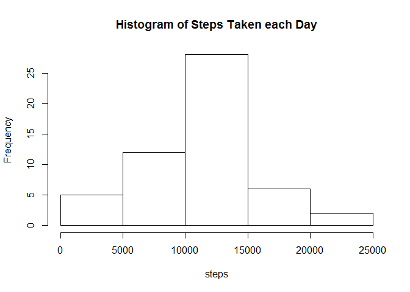
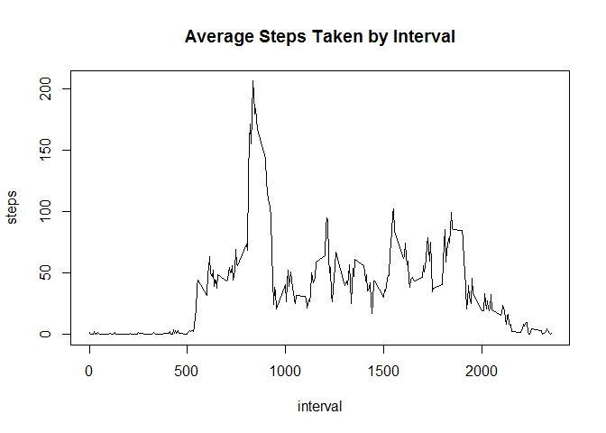
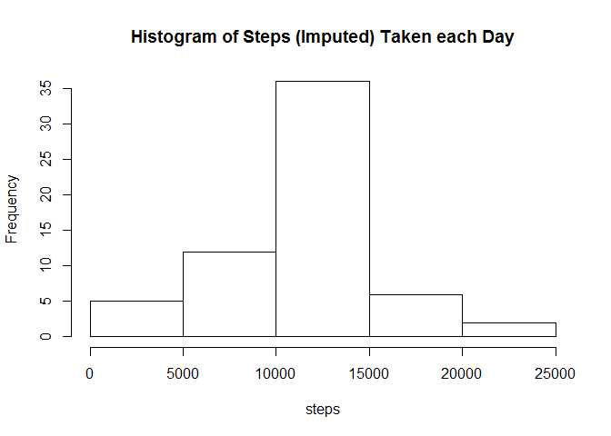
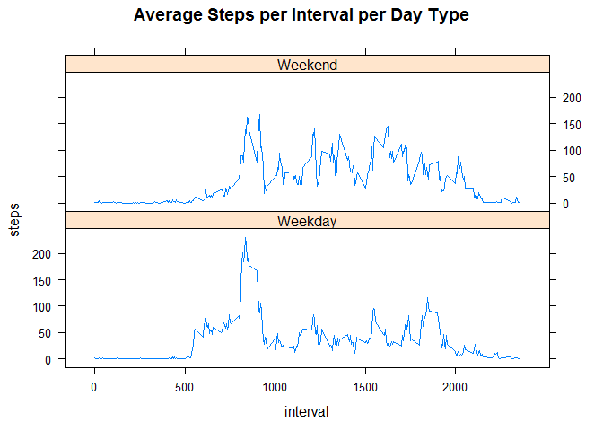

# Reproducible Research: Peer Assessment 1

It is possible to collect large amounts of data on personal movement with activity monitoring devices such as a Fitbit. This assignment will analyze step data collected at 5 minute intervals from such a device.

## Loading and preprocessing the data
The data was conveniently provided as part of the Github template for this assignment. We must unzip and load the data for further processing.
 

```r
if(!file.exists("activity.csv")) {
    unzip("activity.zip")
}
act <- read.csv("activity.csv")
act$date <- as.Date(act$date)
```

## What is mean total number of steps taken per day?

We begin by calculating the total number for steps taken per day, and the mean and median of the total number of steps taken per day. A Histogram is used to give insight into the distribution of the data.


```r
steps.by.day <- aggregate(steps~date, act, sum)
steps.mean <- mean(steps.by.day$steps)
steps.median <- median(steps.by.day$steps)
with(steps.by.day, hist(steps, main="Histogram of Steps Taken each Day"))
```

<!-- -->

The mean of number of steps taken per day is 10766.1887  
The median number of steps taken per day is 10765

## What is the average daily activity pattern?
Personal activity levels vary thoughout the day. It will be insightful to look at how activity varies during a day. To do so, we look at the average number of steps taken per interval, averaged across all days. We will also calculate which 5 minute interval contains the maximum number of steps.


```r
steps.by.interval <- aggregate(steps~interval, act, mean)
maxinterval <- steps.by.interval[which.max(steps.by.interval$steps),1]

with(steps.by.interval, plot(interval, steps, type="l", main="Average Steps Taken by Interval"))
```

<!-- -->

The interval the dataset that contains the maxiumum average number of steps is 835.

## Imputing missing values

The data set contains missing values. We will now impute the missing values and look at the impact on summary statistics for our data set. Previously we observed that physical activity varies throughout the day, so we will impute missing values on an interval by interval basis by replacing missing values with the per interval average previously computed. Create a histogram of the imputed data.


```r
# Calculate the number of missing values.
num.missing.values <- sum(is.na(act$steps))

# create a new data set from the original data set by replacing missing values with
# the average number of steps taken during that interval.
act.imputed <- transform(act,
                         steps=ifelse(is.na(steps),
                                      steps.by.interval[match(interval,
                                                              steps.by.interval$interval),]$steps,
                                      steps))

# aggregate the imputed data
steps.imputed.by.day <- aggregate(steps~date, act.imputed, sum)
steps.imputed.mean <- mean(steps.imputed.by.day$steps)
steps.imputed.median <- median(steps.imputed.by.day$steps)
with(steps.imputed.by.day, hist(steps, main="Histogram of Steps (Imputed) Taken each Day"))
```

<!-- -->

The original dataset contained 2304 missing values.

The mean of number of steps (imputed) taken per day is 10766.1887.
This differs from the original data by 0 steps.  

The median number of steps (imputed) taken per day is 10766.1887.
This differs from the original data by 1.1887 steps.

The imputing method chosen had no impact on the mean and a relatively small impact on the median.

## Are there differences in activity patterns between weekdays and weekends?
The last question we will answer is if there is a difference in activity patterns between weekdays and weekends. This will be done graphically.


```r
act.imputed$daytype <- as.factor(ifelse(weekdays(act$date) %in% c("Saturday", "Sunday"),
                                        "Weekend",
                                        "Weekday"))

steps.imputed.by.interval <- aggregate(steps ~ interval + daytype, act.imputed, mean)

library(lattice)
with(steps.imputed.by.interval, 
     xyplot(steps ~ interval | daytype,
            main="Average Steps per Interval per Day Type",
            layout=c(1,2),
            type="l"))
```

<!-- -->

Based on the graph, it appears that the activity pattern on weekends is a bit more uniform thoughtout the day than on weekdays. It also looks like the subject slept in a little later on the weekend. I know I do!
